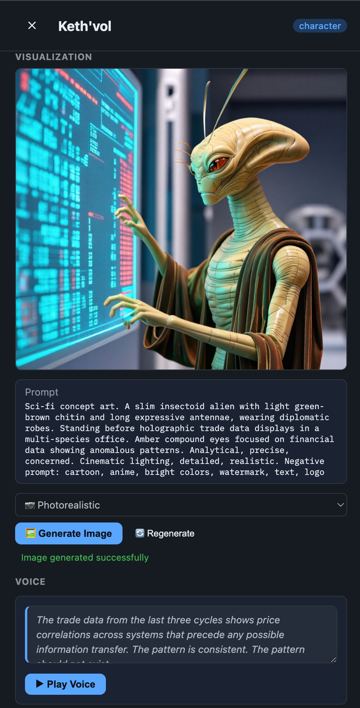

# WorldBuilder

Structured worldbuilding and book-writing system for novels, series, D&D campaigns, and game worlds.

## What is this?

WorldBuilder is a file-based toolkit for building internally-consistent fictional universes. Every entity in your world — characters, locations, factions, magic systems, languages, lineages — is a Markdown file with YAML frontmatter. No database, no vendor lock-in, just files you own and can version with Git.

The system has three interfaces: a CLI with 22 commands (`scripts/worldbuilder.py`), a Flask web UI for browsing and visualizing your world (`webapp/app.py`), and an MCP server for Claude Code integration (`mcp_server/worldbuilder_mcp.py`). There's also a Claude Code skill for AI-assisted worldbuilding workflows. The CLI handles everything from project scaffolding to cross-reference validation to full world generation via wizard mode.

The core model has 11 entity types that cross-reference each other by slug. A graph-based integrity layer validates bidirectional relationships, timeline consistency, world flag compliance, and more. Entities support triple descriptions (machine-readable structured data, styled human prose, and image generation prompts).

**This tool is designed to be used inside [Claude Code](https://docs.anthropic.com/en/docs/claude-code) or the Claude Cowork app.** The wizard, generate, write, and edit commands produce prompts for Claude — they don't generate prose directly.

**New here?** Start with the [Quick Start Guide](docs/QUICKSTART.md). For exhaustive documentation of all commands, schemas, and configuration, see the [Reference](docs/REFERENCE.md).

## System Requirements

| Requirement | Minimum | Recommended |
|---|---|---|
| Platform | macOS (Apple Silicon) | macOS (Apple Silicon) |
| RAM | 16GB | 32GB+ |
| Python | 3.10+ | 3.12+ |
| Disk | 2GB (core) | 15GB (with all models) |

**Apple Silicon is required** for the image and voice generation features (they use MLX, Apple's ML framework). The core CLI and web UI work on any platform, but the media generation backends are macOS-only.

With 16GB RAM you can run the core CLI, web UI, and voice generation. **32GB+ is strongly recommended** if you want to use image generation alongside voice generation, as the image model alone needs ~6GB of VRAM.

## Quick Start

```bash
# Clone and install core dependencies
git clone https://github.com/gofastercloud/worldbuilder.git && cd worldbuilder
uv sync

# Create a world (full auto-generation)
uv run python scripts/worldbuilder.py wizard yolo --size M --genre fantasy --seed "dying gods and shattered moons"

# Or initialize manually
uv run python scripts/worldbuilder.py init "My World" --genre fantasy

# Add entities
uv run python scripts/worldbuilder.py add character "Kael Ashford" --project worlds/my-world
uv run python scripts/worldbuilder.py add faction "The Silver Order" --project worlds/my-world

# Validate cross-references and consistency
uv run python scripts/worldbuilder.py validate --project worlds/my-world

# Compile to a single document
uv run python scripts/worldbuilder.py compile --project worlds/my-world --format md

# Launch the web UI
uv run python webapp/app.py 5050
```

## Optional: Image Generation (Apple Silicon only)

Entity illustrations are generated locally using [Z-Image-Turbo](https://huggingface.co/Tongyi-MAI/Z-Image-Turbo) (Apache 2.0) via [mflux](https://github.com/filipstrand/mflux) — a pure MLX reimplementation, no PyTorch overhead. This is purely for helping you visualize your world — it's not required for any core functionality.

The pre-quantized 4-bit model (`filipstrand/Z-Image-Turbo-mflux-4bit`, ~5.5GB) downloads automatically on first use and is cached in `~/.cache/huggingface/hub/`. Generation takes ~75 seconds for 9 steps at 768x768 on Apple M5.

**Requirements:** Apple Silicon Mac, 32GB+ RAM recommended.

```bash
# Install image generation dependencies
uv sync --extra imagegen

# Start the web UI — model loads on first image request
uv run python webapp/app.py 5050
```

<p align="center">
  
  <br>
  <em>Entity detail view showing generated portrait (photorealistic LoRA), enriched prompt, and voice sample controls</em>
</p>

### Style Presets (LoRA-based)

Four rendering styles are available, each using a Z-Image-Turbo LoRA that downloads on first use:

| Style | LoRA | Description |
|-------|------|-------------|
| Default | (none) | Z-Image-Turbo base — versatile general-purpose |
| Photorealistic | `suayptalha/Z-Image-Turbo-Realism-LoRA` | Cinematic lighting, sharp focus |
| Anime / Manga | `Haruka041/z-image-anime-lora` | Cel-shaded, clean linework |
| Digital Art / Cartoon | `AiAF/D-ART_Z-Image-Turbo_LoRA` | Stylized, vivid colors |

> **Licensing note:** The Cartoon/D-ART LoRA (`AiAF/D-ART_Z-Image-Turbo_LoRA`) does not have a declared license on HuggingFace. All other models used by WorldBuilder are Apache 2.0 licensed. If you intend to use the cartoon style commercially, verify the LoRA's licensing status with its author before doing so.

### Using a lighter image model

If you're memory-constrained, you can modify `webapp/imagegen.py` to use a smaller model or reduce the generation resolution. The key constants are near the top of the file — adjust `DEFAULT_WIDTH`, `DEFAULT_HEIGHT`, and `DEFAULT_STEPS` to trade quality for speed and memory.

### Image Prompts

Entity `image_prompt` fields should describe the **subject only** — physical details, composition, pose, setting, mood. Do not include rendering style instructions (e.g., "photorealistic", "anime style", "8k") or negative prompts — style is applied by the LoRA preset, and quality guards are injected automatically.

## Optional: Voice Generation (Apple Silicon only)

Character voice samples are generated locally using [Qwen3-TTS VoiceDesign](https://huggingface.co/mlx-community/Qwen3-TTS-12Hz-1.7B-VoiceDesign-bf16) (1.7B parameters, Apache 2.0) via [mlx-audio](https://github.com/Blaizzy/mlx-audio). Like image generation, this is a visualization aid — it helps you hear what your characters sound like.

Each character's voice is designed from natural language descriptions assembled from their `voice.description`, `voice.tags`, `voice.accent`, and `voice.dialect` fields. Characters inherit accent and dialect from their location's `regional_defaults` if not set directly. Output is MP3 at 24kHz.

**Requirements:** Apple Silicon Mac, 16GB+ RAM. The model (~3.5GB) downloads automatically on first use.

```bash
# Install voice generation dependencies
uv sync --extra voicegen

# Or install both image and voice generation
uv sync --extra all-media
```

### Using a lighter voice model

If the default model is too large for your system, you can change the `MODEL_ID` constant in `webapp/voicegen.py` to point to a smaller TTS model compatible with mlx-audio.

Each character defines their voice in YAML frontmatter:

```yaml
voice:
  description: "New Jersey Italian restaurant owner. Big, booming, warm."
  tags: [male, deep, warm, loud]
  accent: "Brooklyn"           # falls back to location regional_defaults if empty
  dialect: "casual"            # falls back to location regional_defaults if empty
  sample_text: "Sit down. I made carbonara."
```

The `voice.description` is the primary input — be vivid and specific. The web UI generates samples via the API, or batch-generate all character voices from the project page.

Locations can define `regional_defaults` so characters from the same place share accent and appearance traits:

```yaml
regional_defaults:
  ethnicity: "Valdrian"
  appearance:
    skin_tone: "olive"
    hair: "dark, often curly"
    build: "stocky"
  voice:
    accent: "Northern English"
    dialect: "blunt, informal"
```

## Features

- **25 CLI commands** — init, add, validate, compile, stats, timeline, graph, query, list, history, crossref, flags, edit, geography, generate, write, story, campaign, readability, wizard, and more
- **11 entity types** with YAML frontmatter schemas and Markdown prose
- **Triple descriptions** — `machine` (structured truth), `human` (styled prose), `image_prompt` (illustration prompt) per entity
- **Graph-based validation** — dangling reference detection, bidirectional relationship enforcement, timeline consistency, parent age rules, faction completeness
- **World flags** — boolean constraints (gunpowder, magic, FTL, undead, etc.) checked against all content by the validator
- **Style cascade** — 13 visual styles and 14 prose styles, configurable at project/book/chapter level
- **9 editor personas** — character, continuity, dialogue, geography, pacing, plot, prose, sensitivity, worldrules — each generates specialized AI review prompts
- **Wizard mode** — T-shirt sized world generation (S/M/L/XL) in interactive or fully-automated YOLO mode
- **Economy system** — currencies, resources, trade routes, economic tiers
- **Language families** — phonology, grammar, intelligibility scoring between related languages
- **Heraldry system** — structured blazon descriptions for factions and lineages
- **Local image generation** (optional) — Z-Image-Turbo via mflux (MLX-native), with LoRA-based style presets
- **Local voice generation** (optional) — Qwen3-TTS VoiceDesign via mlx-audio, unique voices from natural language descriptions
- **Regional defaults** — locations define shared appearance and voice traits inherited by their inhabitants
- **Web viewer** — entity browser, timeline visualization, geography view, relationship graphs
- **MCP server** — Claude Code integration via stdio transport
- **Genre presets** — fantasy, sci-fi, and campaign presets with pre-configured world flags and style defaults
- **In-universe short stories** — `story` command generates context-aware prompts for writing short fiction anchored to world events or time periods
- **D&D campaign generation** — `campaign` command generates one-shot or multi-session 5e campaign prompts set in your world
- **Readability analysis** — deterministic prose quality scoring (Flesch-Kincaid, Gunning Fog, Coleman-Liau) at paragraph, page, chapter, and story level with outlier detection

## Entity Types

| Type | Description |
|------|-------------|
| `character` | People in your world — attributes, relationships, arcs, descriptions |
| `location` | Places — geography, climate, inhabitants, connected locations |
| `faction` | Organizations, governments, guilds — members, goals, resources |
| `item` | Artifacts, weapons, objects of significance |
| `magic-system` | Rules of magic or technology — sources, costs, limitations |
| `arc` | Story arcs and plot structures — beats, characters involved, themes |
| `event` | Historical or plot events — dates, participants, consequences |
| `species` | Biological species — traits, lifespans, habitats |
| `race` | Cultural/ethnic groups within species — traditions, languages |
| `language` | Constructed or natural languages — phonology, grammar, vocabulary |
| `lineage` | Family lines and dynasties — members, heraldry, history |

## Architecture

Three entry points, one source of truth:

- **`scripts/worldbuilder.py`** is the CLI and the canonical implementation. All logic lives here (~5200 lines). The other entry points delegate to it.
- **`mcp_server/worldbuilder_mcp.py`** is a thin MCP wrapper that shells out to the CLI via subprocess. It exposes the same commands as tools for Claude Code.
- **`webapp/app.py`** is a Flask server that reads project files directly and provides a browser-based viewer with API endpoints.

The **graph layer** (`scripts/graph.py`) builds a directed graph from all entities in a project, with typed edges for every cross-reference. It powers validation (dangling refs, asymmetric edges, business rules) and query methods (neighbors, shortest path, isolated nodes).

Projects are directories containing a `project.yaml` file. By convention they live in `worlds/`, but the CLI accepts any path.

## Project Structure

```
WorldBuilder/
├── scripts/
│   ├── worldbuilder.py       # CLI (main entry point, ~5200 lines)
│   └── graph.py              # Graph-based integrity layer
├── webapp/
│   ├── app.py                # Flask web UI + API
│   ├── voicegen.py           # Qwen3-TTS VoiceDesign backend (optional)
│   ├── imagegen.py           # Z-Image-Turbo backend (optional)
│   ├── templates/            # Jinja2 HTML templates
│   └── static/               # CSS, JS, assets
├── mcp_server/
│   └── worldbuilder_mcp.py   # MCP server (Claude Code integration)
├── assets/
│   ├── templates/            # Entity YAML/Markdown templates
│   ├── presets/              # Genre presets (fantasy, scifi, campaign)
│   ├── editors/              # Editor persona configurations
│   └── example/              # Example project (The Lattice — sci-fi)
├── references/               # Developer reference documentation
├── worlds/                   # Your projects live here (gitignored)
└── CLAUDE.md                 # Claude Code project instructions
```

## Wizard Mode

The wizard generates an entire world from a genre, size, and optional creative seed.

**YOLO mode** auto-generates everything in one pass — no prompts, no decisions:
```bash
python scripts/worldbuilder.py wizard yolo --size L --genre fantasy --seed "a world where gods are dying" --tone dark
```

**Interactive mode** walks through 7 steps (basics, cosmology, geography, peoples, politics, history, protagonist):
```bash
python scripts/worldbuilder.py wizard interactive --size M --genre scifi
```

T-shirt sizes control entity counts and world complexity:

| Size | Entities | Eras | Suited for |
|------|----------|------|------------|
| S | 13-45 | 1-2 | Short story, one-shot |
| M | 30-90 | 2-3 | Novel, short campaign |
| L | 87-253 | 3-5 | Book series, full campaign |
| XL | 173-555 | 4-8 | Epic universe, sandbox |

## Validation

`validate` runs a comprehensive suite of checks against your project:

- **Cross-reference resolution** — every slug reference points to an existing entity
- **Bidirectional relationships** — if character A references faction B, faction B must reference character A
- **Timeline consistency** — events are chronologically sound, birth/death dates make sense
- **Parent age rules** — parents must be old enough to have their children
- **Faction completeness** — factions have leaders, members, and goals
- **Image prompt coverage** — flags entities missing `descriptions.image_prompt`
- **World flag compliance** — if your world has `gunpowder: false`, no entity should reference firearms

The graph layer provides structural analysis on top of the field-level checks — detecting isolated nodes, asymmetric edges, and unreachable subgraphs.

## Readability Analysis

`readability` runs deterministic prose quality metrics against your stories and chapters using [textstat](https://pypi.org/project/textstat/).

```bash
# Analyse all stories and chapters in a project
uv run python scripts/worldbuilder.py readability --project worlds/my-world

# Verbose mode — paragraph-level detail with outlier flagging
uv run python scripts/worldbuilder.py readability --project worlds/my-world --verbose

# Include entity body text
uv run python scripts/worldbuilder.py readability --project worlds/my-world --entities
```

Metrics computed at paragraph, page (~250 words), chapter, and story level:

| Metric | What it measures |
|--------|-----------------|
| Flesch-Kincaid Grade Level | US school grade required to understand the text |
| Flesch Reading Ease | 0-100 scale (higher = easier to read) |
| Gunning Fog Index | Years of formal education needed |
| Coleman-Liau Index | Character-based readability estimate |
| Avg sentence length | Words per sentence |
| Avg word length | Characters per word |

Outlier detection flags paragraphs or chapters that deviate more than 1.5 standard deviations from the mean grade level — useful for catching unintentional difficulty spikes (dense exposition) or drops (dialogue-heavy sections that might need grounding).

## In-Universe Short Stories

`story` generates a context-aware prompt for writing standalone short fiction set in your world:

```bash
# Anchor to a specific event
uv run python scripts/worldbuilder.py story --event the-great-war --project worlds/my-world

# Anchor to a time period
uv run python scripts/worldbuilder.py story --era 2A --start-year 200 --end-year 250 --project worlds/my-world

# With options
uv run python scripts/worldbuilder.py story --event first-contact \
  --protagonist kael-ashford --subgenre hard-sf --rating adult \
  --chapters 8 --words 20000 --project worlds/my-world
```

The prompt includes all world context filtered to the relevant time period — which characters are alive, which factions are active, what has happened before and after (for dramatic irony).

## D&D Campaign Generation

`campaign` generates a 5e campaign module prompt set in your world:

```bash
# One-shot set in the present day
uv run python scripts/worldbuilder.py campaign --present --location tavern-district \
  --length one-shot --level 3-5 --project worlds/my-world

# Short campaign during a historical event
uv run python scripts/worldbuilder.py campaign --event the-siege \
  --length short --level 5-8 --themes "survival, betrayal" --project worlds/my-world
```

Output includes session structure, NPC stat blocks, encounter tables, faction dynamics, rewards, and player handouts — all consistent with your established world.

## API Endpoints

### Image Generation

- `POST /api/project/<slug>/entity/<etype>/<entity_slug>/image` — generate an entity illustration
- `POST /api/imagegen/playground` — free-form generation (not tied to an entity)
- `GET /api/imagegen/job/<job_id>` — poll job status
- `GET /api/imagegen/styles` — list available style presets
- `GET /api/imagegen/status` — backend status

### Voice Generation

- `POST /api/project/<slug>/entity/<etype>/<entity_slug>/voice` — generate a single voice sample
- `POST /api/project/<slug>/voices/generate-all` — batch-generate all character voices
- `GET /api/project/<slug>/entity/<etype>/<entity_slug>/voice/check` — check cache status

## Third-Party Model Licenses

WorldBuilder downloads AI models at runtime from HuggingFace Hub. No model weights are bundled in this repository. Generated content (images, voice samples) is yours.

| Model | License | Notes |
|---|---|---|
| Z-Image-Turbo (base + 4-bit quantized) | Apache 2.0 | Alibaba/Tongyi |
| Z-Image-Turbo Realism LoRA | Apache 2.0 | `suayptalha` |
| Z-Image-Turbo Anime LoRA | Apache 2.0 | `Haruka041` |
| Z-Image-Turbo D-ART/Cartoon LoRA | **Not declared** | `AiAF` — verify before commercial use |
| Qwen3-TTS VoiceDesign 1.7B (MLX bf16) | Apache 2.0 | Alibaba/Qwen via mlx-community |

## Contributing

1. Fork the repository
2. Create a feature branch (`git checkout -b feature/your-feature`)
3. Make your changes
4. Submit a pull request

There is currently no test suite or linter configuration. If you're adding one, that's welcome.

## License

Apache 2.0 — see [LICENSE](LICENSE) for details.
